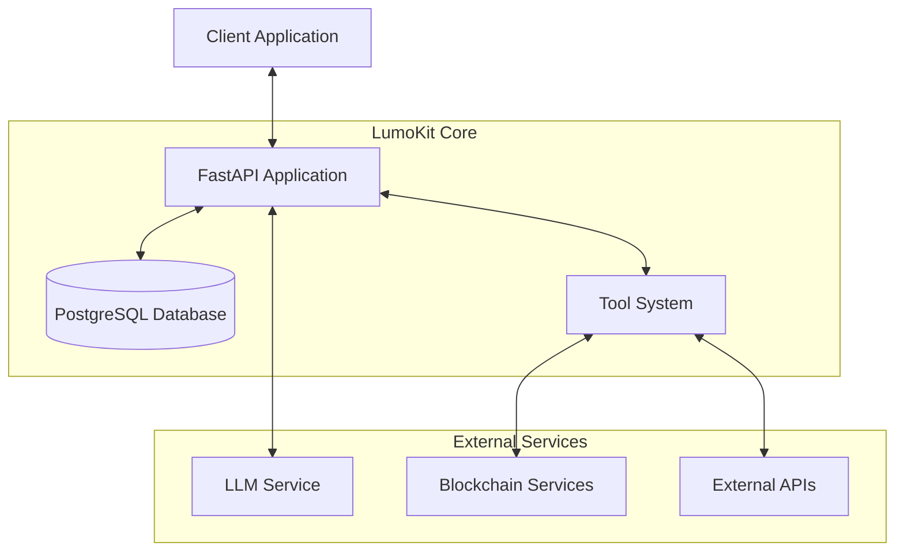
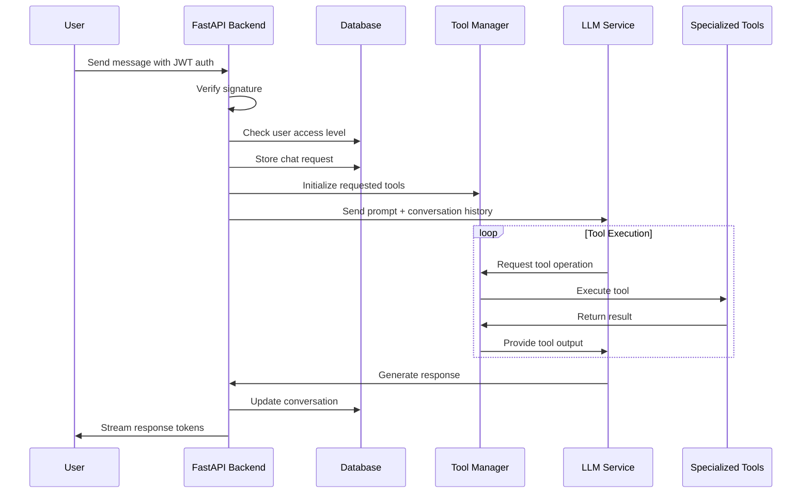
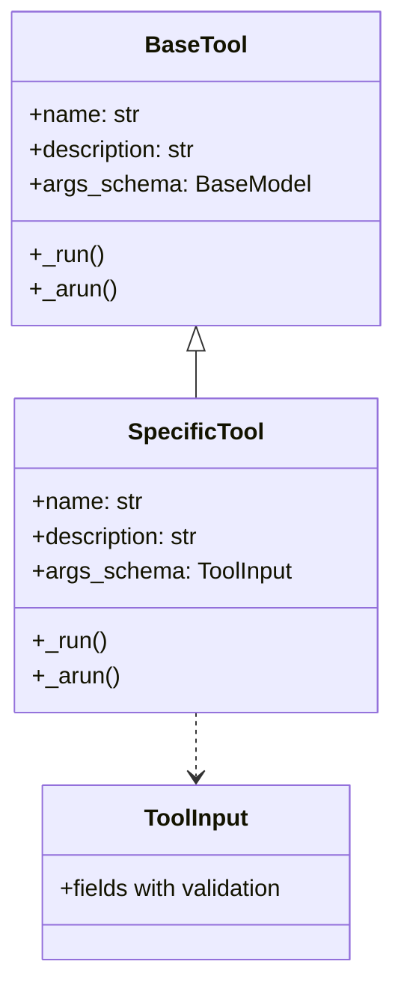

<h1 align="center">LumoKit - v1.1.0</h1>

<p align="center">
  
</p>

<p align="center">
  <b>A lightweight AI Toolkit Framework for Solana</b><br>
  <span>Offering a multitude of on-chain actions and research capabilities</span>
</p>

<p align="center">
  <a href="https://lumokit.ai"></a>
  <a href="https://lumolabs.ai"></a>
  <a href="https://x.com/lumolabsdotai"></a>
  <a href="https://t.me/lumolabsdotai"></a>
  <a href="https://github.com/Lumo-Labs-AI"></a>
  <a href="https://huggingface.co/lumolabs-ai"></a>
</p>

## 📚 Table of Contents

- Overview
- System Architecture
- Project Structure
- Tools System
- Getting Started
  - Prerequisites
  - Installation
  - Environment Configuration
  - Running the Application
- API Documentation
- Development
- Deployment
- Contributing
- License

## 🔍 Overview

LumoKit is a powerful AI toolkit framework built specifically for the Solana blockchain ecosystem. It combines LLM capabilities with blockchain tools to enable users to perform various on-chain actions and gather research data through a conversational interface.

The intention of the framework is to be a codebase that's primarily easy to build on, in terms of tools additions.

## 🏗 System Architecture

LumoKit backend follows a FastAPI-based architecture with PostgreSQL for data storage:



### Chat Flow Process



## 📁 Project Structure

LumoKit is organized into the following directory structure:

| Directory/File | Description |
| -------------- | ----------- |
| src | Main source code directory |
| api | API routes and controllers |
| tools | Tool implementations |
| models | Database models |
| settings | Configuration settings |
| helper | Helper functions |
| docker-compose.prod.yml | Production Docker configuration |
| Dockerfile.prod | Docker build configuration |
| .env.example | Example environment variables |
| Makefile | Development and deployment commands |
| pyproject.toml | Python project configuration |

## 🛠 Tools System

The heart of LumoKit is its extensible tools system. Each tool is implemented as a class that inherits from `BaseTool` and provides specific functionality:

### Tool Architecture

Tools in LumoKit follow a consistent pattern:



Each tool implements:
- `_arun()`: Asynchronous execution method
- `_run()`: Synchronous fallback method (usually redirects to async)

## 🚀 Getting Started

### Prerequisites

- Python 3.11+
- PostgreSQL 13+
- Docker & Docker Compose (for production deployment)
- Solana RPC endpoint (preferably a dedicated one)
- API keys for various services (see environment variables)

### Installation

Refer to our documentation at https://lumolabs.ai -> LumoKit -> Installation

### Environment Configuration

Copy the example environment file and modify it with your settings:

```bash
cp .env.example .env
```

Important environment variables:

| Variable | Description | Example |
| -------- | ----------- | ------- |
| `POSTGRES_*` | Database connection details | `lumokit_db`, `lumokit_root`, etc. |
| `SOLANA_RPC_URL` | URL for Solana RPC node | `https://api.mainnet-beta.solana.com` |
| `OPENAI_API_KEY` | API key for OpenAI services | `sk-...` |
| `WALLET_ENCRYPTION_SALT` | Salt for wallet encryption | `random_salt_value` |
| `PRO_MEMBERSHIP_WALLET` | Wallet receiving membership payments | `CsTmcGZ5UMRzM2DmWLjayc2sTK2zumwfS4E8yyCFtK51` |
| `PRO_MEMBERSHIP_TOKEN` | Token address for membership payments | `4FkNq8RcCYg4ZGDWh14scJ7ej3m5vMjYTcWoJVkupump` |
| `PRO_MEMBERSHIP_COST` | Cost of pro membership | `22000` |
| `FREE_USER_DAILY_LIMIT` | Daily message limit for free users | `10` |
| `PRO_USER_DAILY_LIMIT` | Daily message limit for pro users | `200` |

### Running the Application

#### Launching LumoKit

Make sure that you have docker running in your system.

```bash
# First time - make sure your environment variables are set first
make build migrate

# Build the Docker containers
make build

# Start the services
make up

# Check logs
make logs

# Simple command to restart and launch
make down build up logs
```

## 📝 API Documentation

Once the application is running, API documentation is available at:

- Swagger UI: `http://localhost/docs`
- ReDoc: `http://localhost/redoc`

## 💻 Development

### Adding a New Tool

1. Create a new file in tools or add to an existing one
2. Define input schema using Pydantic
3. Implement the tool class inheriting from `BaseTool`
4. Add the tool to __init__.py exports
5. Add tool description to `TOOL_DESCRIPTIONS` in __init__.py

Example tool implementation:

```python
from typing import ClassVar, Type
from langchain.tools import BaseTool
from pydantic import BaseModel, Field

class ExampleToolInput(BaseModel):
    """Input schema for the example tool."""
    parameter: str = Field(..., description="Description of parameter")

class ExampleTool(BaseTool):
    """Tool for performing an example operation."""
    
    name: ClassVar[str] = "example_tool"
    description: ClassVar[str] = "Description of what this tool does"
    args_schema: ClassVar[Type[BaseModel]] = ExampleToolInput
    
    async def _arun(self, parameter: str) -> str:
        """Execute the tool asynchronously."""
        # Implementation
        return "Result"
        
    def _run(self, parameter: str) -> str:
        """Synchronous version returns a message instead of raising an error."""
        return "This tool only supports asynchronous execution."
```

### Database Migrations

```bash
# Create a new migration
make migrations MSG="Migration message"

# Apply migrations
make migrate
```

## 🚢 Deployment

LumoKit is designed to be deployed using Docker Compose:

```bash
# Build and deploy to production
make build
make up

# To shut down
make down

# View logs
make logs
```

For production, ensure you:
1. Set appropriate environment variables
2. Use a production-grade PostgreSQL setup
3. Configure proper firewalls and security
4. Set up SSL/TLS termination
5. Configure proper backup strategy for the database

## 👨‍💻 Contributing

Contributions are welcome! To contribute:

1. Fork the repository
2. Create a feature branch
3. Make your changes
4. Run tests and linting
5. Submit a pull request

Please follow the coding style and add appropriate tests.

## 📄 License

© 2025 Lumo Labs. LumoKit is open source and licensed under the GNU Affero General Public License v3.0 (AGPL-3.0).

---

<p align="center">
  <a href="https://dexscreener.com/solana/4FkNq8RcCYg4ZGDWh14scJ7ej3m5vMjYTcWoJVkupump">
    
  </a>
</p>